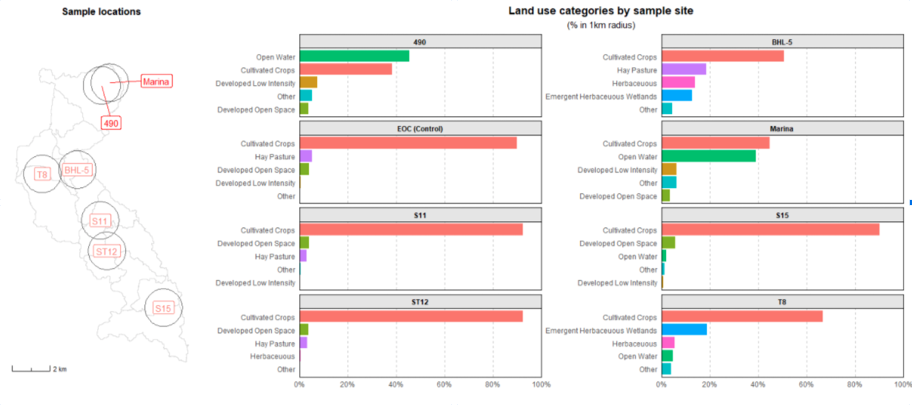
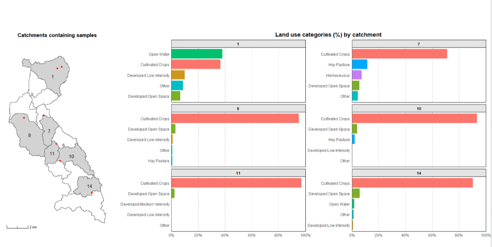

I was cleaning through my repos and I found slides I made for a workshop I gave at [LunchinatoRs](https://github.com/ISU-LunchinatoRs), Iowa State University's Department of Ecology, Evolution, and Organismal Biology weekly R meeting. 
It was a short presentation meant as a crash course in the basics of plotting shapefiles in ggplot2, with a little animation as a little atreat.

You can see the slides [here](https://pommevilla.github.io/lunchinatoR/11202020#1) and find the repo [here](https://github.com/pommevilla/lunchinatoR). 

I plot a fair amount of maps in my research, usually as a nice figure to show where our samples are coming from.
Other times I use it shapefiles and GIS layers to generate more data for our experiments. 
For example, I made these plots for an earlier project. Like most of my research, we were investigating human impact on the environment - this time, in particular, how agricultural practices in surrounding areas impacted water health in Iowa lakes. As part of our data gathering, we used land use classification data from [MRLC](https://www.mrlc.gov/) as an additional data point. At some point, I made these plots to show where the samples were taken from and to measure what percentage of surrounding land corresponded to which land use categories:

