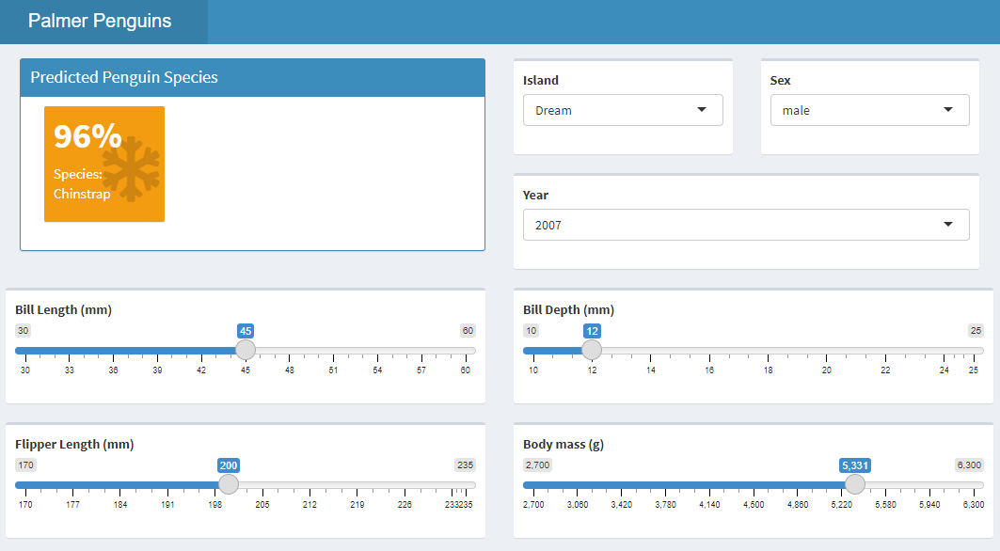

```{r, message=FALSE, echo=FALSE, warning=FALSE}
library(tidyverse)
library(tidymodels)
library(palmerpenguins)

theme_set(theme_light())
```

I've been interested in learning Shiny for a while. 
It'd be really useful to be able to whip one up real quick to do some basic EDA, and it'd be nice to share with colleagues so that they can do some investigating of their own. 
I never really found the time to do this before, but over the past few months, I've found myself recently sharing RMarkdown documents that do the same analysis with several members of my lab ([see here](https://pommevilla.github.io/crop_priming/analysis_so_far.html) for an example). 
This analysis is also good candidate for a package, but I'm using this as my excuse to finally pick up Shiny.

While I'm learning Shiny, I thought it'd be a good idea to do some basic [tidymodels](https://www.tidymodels.org/) practice. 
I've used the package quite extensively in my [harmful algal blooms]() prediction project, but it's been a while and I thought I'd practice both at the same time by implementing a prediction model in Shiny. Credit goes to [Andrew Couch](https://www.youtube.com/c/AndrewCouch/videos) for all of his great videos teaching Shiny.

## The data

Today, we'll be using the [Palmer Penguins](https://allisonhorst.github.io/palmerpenguins/) dataset. From the website:

> The goal of palmerpenguins is to provide a great dataset for data exploration & visualization, as an alternative to iris.

{Alison Hill](https://twitter.com/apreshill), my mentor during my RStudio internship, is also an author on the package, but I'm totally not biased, I swear.

Also, a note before we get started - this isn't meant to be a full comprehensive analysis of the dataset. The purpose of this exercise was to create a model and serve it in a Shiny app to make predictions.

Let's begin by taking a look at how many NAs are missing in the dataset:

```{r}
colSums(is.na(penguins))
```

We see that the only missing values are in `sex`, and there is only 9. Let's see how those missing values are distributed across the species:

```{r}
penguins %>% 
  filter(is.na(sex)) %>% 
  count(species)
```

An even split between Adelie and Gentoo, the two species with the most representatives:

```{r}
penguins %>% 
  count(species)
```

While we can probably throw away the data and not feel bad, let's see if we can impute the missing data.
Let's take a look at the other variables:

```{r}
penguins %>% 
  pivot_longer(cols = bill_length_mm:body_mass_g, names_to = "metric", values_to = "value") %>% 
  ggplot(aes(species, value, color = sex)) +
  geom_boxplot() +
  facet_wrap(~ metric, scales = "free")
```

There seems to be a significant difference between the male and female penguins, so it seems reasonable to impute the missing values.

## Parameter tuning

Let's start by splitting the data into a testing and training set:

```{r}
set.seed(489)

tidy_split <- initial_split(penguins %>% select(-year))
tidy_train <- training(tidy_split)
tidy_test <- testing(tidy_split)

tidy_kfolds <- vfold_cv(tidy_train)

```

Here, we're creating a recipe that will try to predict the species based on all the other columns after performing a few preprocessing steps:

* Impute the missing sex values via k-nearest neighbors
* Convert the factors to dummy variables via one hot encoding
* Normalize the predictors

```{r}
tidy_rec <- recipe(species ~ ., data = tidy_train) %>% 
  step_impute_knn("sex") %>% 
  step_dummy(all_nominal(), -all_outcomes(), one_hot = TRUE) %>% 
  step_impute_median(all_predictors()) %>% 
  step_normalize(all_predictors())
```

Before we actually get to prediction, we'll do some parameter tuning. We'll be using an xgboost model, so the parameters we'll be tuning are `trees`, `min_n`, and the `learn_rate`:


```{r}
tidy_boosted_model <- boost_tree(trees = tune(),
                                 min_n = tune(),
                                 learn_rate = tune()) %>% 
  set_mode("classification") %>% 
  set_engine("xgboost")
```

`grid_regular` creates a grid of potential parameter values 3 levels deep for the parameter tuning process. `tune_grid` then actually performs the tuning, after which we can retrieve the parameters that achieved the best ROC AUC on the test set. 

We're using ROC AUC here because the data set has some class imbalances.
While the imbalance isn't as bad as some other datasets, it's still enough to make me want to switch to ROC AUC.

```{r, cache=TRUE}
boosted_grid <- grid_regular(parameters(tidy_boosted_model), levels = 3)

boosted_tune <- tune_grid(tidy_boosted_model,
          tidy_rec, 
          resamples = tidy_kfolds,
          grid = boosted_grid)

boosted_params <- boosted_tune %>% 
  select_best("roc_auc")

```

We now finalize our model with those parameters we found and wrap that finalized model up into a workflow with our preprocessing recipe. Finally, we fit it on the training set and make predictions on the test set.

## Predictions and metrics

```{r}
tidy_boosted_model <- finalize_model(tidy_boosted_model, boosted_params)

boosted_workflow <- workflow() %>% 
  add_model(tidy_boosted_model) %>% 
  add_recipe(tidy_rec)

boosted_results <- last_fit(boosted_workflow, tidy_split)
```


Let's see how it did!

```{r}
boosted_results %>% 
  unnest(.predictions) %>% 
  conf_mat(truth = species, estimate = .pred_class) %>% 
  pluck("table") %>% 
  reshape2::melt() %>% 
  ggplot(aes(Truth, Prediction, fill = value)) +
  geom_tile(color = "black", size = 1) +
  theme(
    panel.grid = element_blank(),
    panel.border = element_blank(),
    axis.ticks = element_blank(),
    legend.position = "none"
  ) + 
  geom_text(aes(label = value)) + 
  scale_fill_gradient(low = "white", high = "blue") + 
  scale_y_discrete(limits = rev) +
  labs(
    title = "Palmer Penguins Confusion Matrix"
  )
  
```

Looks like it did really well, having only missed two 2 predictions out of 86. The actual metrics are:

```{r}
boosted_results %>% 
  unnest(.metrics) %>% 
  select(.metric, .estimate)
```

The metrics were very high, but this makes sense given the clustering of the dataset. We can visualize this with an NMDS:


```{r, message=FALSE, warning=FALSE, results='hide'}
library(vegan)

penguins <- penguins %>% 
  mutate(row_num = row_number())

penguin.NMDS <- metaMDS(
  penguins %>% 
    select(-c(year, species, island, sex, row_num)) %>% 
    filter(!is.na(.)),
  k = 3)

# The stress of the NMDS was below 0.05, indicating that reducing the dimensions of the data does a fair job.
penguin.NMDS$stress

# We have to filter out NAs since `metaMDS` doesn't like them
penguin.NMDS <- as.data.frame(vegan::scores(penguin.NMDS, display = "sites")) %>% 
  bind_cols(
    penguins %>% 
      select(-c(year, species, island, sex)) %>% 
      filter(!is.na(.)) %>% 
      left_join(penguins, by = "row_num") %>% 
      select(-row_num)
      
  )

penguin.NMDS %>% 
  ggplot(aes(NMDS1, NMDS2, color = species)) +
  geom_point(size = 2) + 
  geom_hline(yintercept = 0.0,
             colour = "grey",
             lty = 2) +
  geom_vline(xintercept = 0.0,
             colour = "grey",
             lty = 2) +
  labs(
    color = "Species",
    title = "Palmer Penguins NMDS"
  ) + 
  theme(
    panel.grid = element_line(color = "gray95"),
    panel.border = element_rect(color = "black", size = 1, fill = NA)
  ) 
```


We see that the species of penguins cluster quite strongly, with Gentoo separating cleanly from the other two species. While Adelie and Chinstrap are relatively close, there are is still a clear distinction between the two clusters. Models doing this well make me nervous, but seeing how well-separated the plot is puts my mind to rest a little bit.

## Using the model in a Shiny app

Like I mentioned up top, I was mostly doing this to learn how to use a Shiny App. 
To start off with, let's get a final model and save it to an `RDS` for use in our app.

```{r}
final_boosted_model <- fit(boosted_workflow, penguins)
saveRDS(final_boosted_model, "penguin_model.RDS")
```

I then loaded that model into a simple Shiny app that takes The different measurements and tries to predict the species:



You can play with the app [here](https://pommevilla.shinyapps.io/shiny_penguins) and check out the code [here](https://github.com/pommevilla/shiny_penguins/blob/main/R/app.R). It's a super simple app, but I wanted to get the hang of the Shiny workflow before I start doing some more intense ones. I'll blog my experience creating a Shiny app for reproducible microbial analysis when I get started with that. 