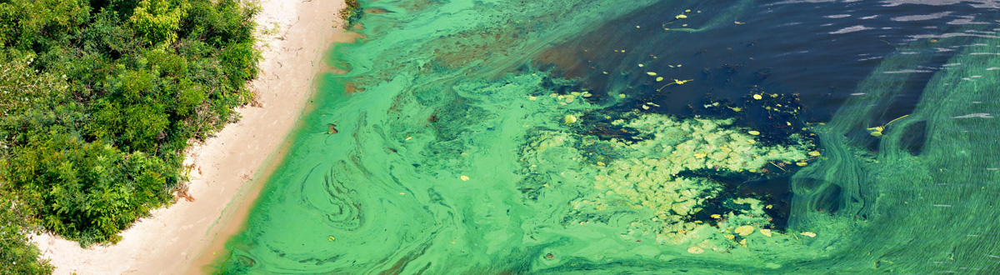

---
categories:
- GERMS
- Research
date: "2019-07-03"
draft: false
weight: 1
excerpt: Using chemical, biological, climate, and land-use data to predict harmful algal blooms.
layout: single
tags:
- Modeling
title: Predicting Harmful Algal Blooms in Iowa
---

(credit: https://www.cdc.gov/habs)

My general research interests are in understanding the impact of human activity on the environment. While climate change is certainly the most well-known and pressing of these impacts, there are other related outcomes that need to be understood. One such area is harmful algal blooms:

> Harmful algal blooms are the rapid growth of algae or cyanobacteria that can cause harm to people, animals, or the local ecology. Harmful algae or cyanobacteria can look like foam, scum, paint, or mats on the surface of water and can be different colors. These blooms can produce toxins that make people and animals sick. Blooms occur in fresh water, such as lakes and rivers, and salt water, such as oceans or bays.

This a project done in cooperation with the [Iowa Department of Natural Resources](https://www.iowadnr.gov/). Water samples from 38 lakes have been taken over three years. For each sample, we have various chemical and biological measurements, as well as climate data and land use information. Our questions for this research project were:

* How accurately can we predict the onset of a harmful algal bloom in the next week?
* How much does climate data and land-use information improved our predictions, and is it worth the effort to collect and clean this information?

A general workflow is described below:

If you'd like to learn more about this project, see this [short presentation](https://iastate.app.box.com/file/887674234460?s=3wy28ffzzrx9spt77yty12lhkl1corca) I put together to lead a discussion for an introductory bioinformatics class at Iowa State University.

