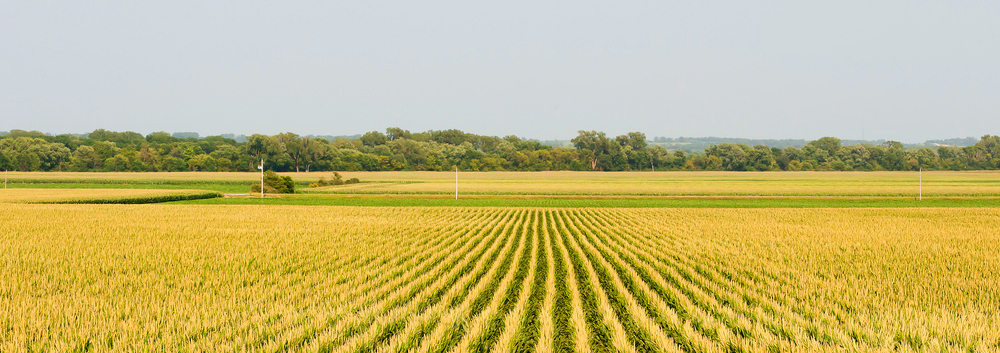

---
categories:
- GERMS
- Research
- Human impact
date: "2019-07-03"
draft: false
excerpt: Examining how different crop priming additions impact the nitrogen fixation capabilities of corn and *Miscanthus Gigantus*.
layout: single
tags:
- quarto
title: Quantifying the effects of crop priming on nitrogen fixation
---

(credit: http://www.agyield.com)

This research project examines how different crop priming additions impact the nitrogen fixation capabilities of corn and miscanthus. This project is currently in its early stages. However, you can see what analysis I've done so far in this [research journal](https://pommevilla.github.io/crop_priming/analysis_so_far.html) I've been keeping.